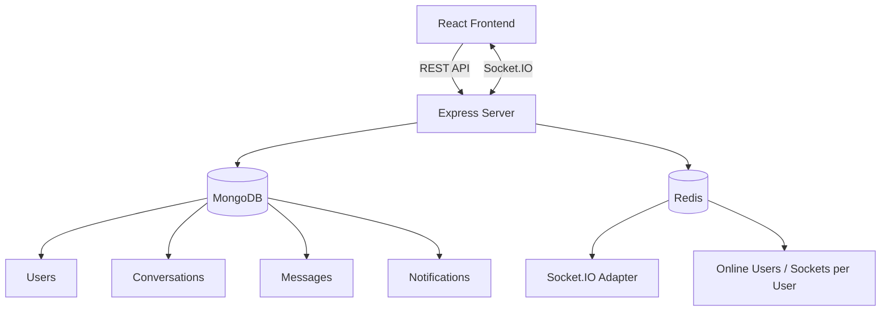

---
# 💬 Pulse — Real-Time Messaging App

<p align="center">
  
  
  
  
  
  
  
</p>

A modern real-time messaging application built using the **MERN Stack**, **Socket.IO**, **Redis**, and **JWT Authentication**. Pulse delivers secure, fast, and responsive communication with live messaging, friend management, notifications, and a clean user experience.

---

## 📚 Table of Contents

- [Overview](#-overview)
- [Features](#-features)
- [Tech Stack](#-tech-stack)
- [System Architecture](#-system-architecture)
- [Project Structure](#-project-structure)
- [Installation](#-installation)
- [Environment Variables](#-environment-variables)
- [Running the Application](#-running-the-application)
- [Real-Time Features](#-real-time-features)
- [API Overview](#-api-overview)
- [Performance Highlights](#-performance-highlights)
- [Security](#-security)
- [Roadmap](#-roadmap)
- [Built With](#-built-with)
- [Author](#-author)
- [Show Your Support](#-show-your-support)
- [License](#-license)

---

## 📖 Overview

Pulse is a full-stack messaging platform that enables users to communicate instantly through real-time WebSocket connections. The application combines REST APIs with Socket.IO to provide a seamless chatting experience, while Redis manages online-user tracking and scalable socket communication across server instances.

This project was built to demonstrate modern full-stack development practices: authentication, real-time communication, RESTful APIs, responsive frontend design, and scalable backend architecture.

---

## ✨ Features

### 🔐 Authentication
- User registration & secure login
- JWT authentication (REST via Bearer token, sockets via handshake auth)
- Password hashing with bcrypt
- Protected routes and session handling

### 💬 Real-Time Messaging
- Instant one-to-one messaging
- Typing indicators
- Online/offline presence, resilient across multiple tabs/devices
- Read receipts (only marked "Read" once the other participant has actually seen it)
- Emoji reactions on messages, synced live to all participants
- Message editing and deletion

### 👥 Friend System
- Send, accept, and reject friend requests
- Remove friends
- Block / unblock users (blocked users can't message you, enforced both directions)
- Privacy setting

### 🔔 Notifications
- Real-time notifications for messages, friend requests, and accepted requests
- Each notification says who did what (e.g. "Alex sent you a message")
- Mark one/all as read, delete one, or clear all read notifications
- Clicking a notification jumps to the right conversation or the friend-requests panel

### 👤 User Profile
- Update display name
- Change password
- Delete account

### 📁 File Sharing
- Upload files with a preview + optional caption before sending
- Served as message attachments over the socket

### 🎨 User Interface
- Responsive design down to mobile widths, with a collapsible nav drawer and full-screen chat view
- Light/dark theme, remembered across sessions
- Sidebar conversation list with a floating menu (block, delete conversation)
- Clean navigation and profile dropdown

---

## 🛠 Tech Stack

### Frontend
- React
- Vite
- React Router
- Axios
- Socket.IO Client
- HTML5 / CSS3

### Backend
- Node.js
- Express.js
- MongoDB
- Mongoose
- Socket.IO
- JWT
- bcrypt
- Multer
- Redis
- ioredis

---

## 🏗 System Architecture



**Flow summary:**
1. The React frontend talks to the Express server via REST endpoints for standard CRUD operations (auth, profile, friends, conversations).
2. Socket.IO maintains persistent bidirectional connections for real-time events (messages, typing, presence, reactions, notifications).
3. MongoDB persists core application data.
4. Redis backs the Socket.IO adapter for horizontal scaling and tracks which users are currently online.

---

## 📂 Project Structure

```
realtime-chat/
├── backend
│   ├── src
│   │   ├── config          # db.js, redis.js
│   │   ├── controllers      # auth, user, conversation, message, notification, upload
│   │   ├── middleware        # authMiddleware, errorMiddleware, uploadMiddleware
│   │   ├── models            # User, Conversation, Message, Notification
│   │   ├── routes            # REST endpoints
│   │   ├── sockets           # socketAuth, presence/typing/chat handlers, ioInstance, index.js
│   │   ├── utils             # generateToken, redisKeys
│   │   ├── app.js
│   │   └── server.js
│   ├── uploads
│   └── package.json
│
├── frontend
│   ├── src
│   │   ├── api               # axios.js
│   │   ├── components        # Sidebar, UserList, ChatWindow, MessageList, MessageInput,
│   │   │                      # TypingIndicator, NotificationBell, FileUpload, NavBar,
│   │   │                      # ProfileMenu, Snackbar, ConfirmSnackbar
│   │   ├── context           # AuthContext, SocketContext, ThemeContext
│   │   ├── hooks              # useAuth, useSocket, useTheme, usePersistentIdSet
│   │   ├── pages              # Login, Register, Chat, Profile, Archive, Hidden
│   │   ├── App.jsx
│   │   └── main.jsx
│   └── package.json
│
├── docker-compose.yml         # spins up Mongo + Redis locally
└── README.md
```

---

## 🚀 Installation

### Clone Repository

```bash
git clone https://github.com/Omar-Hashmi/Pulse-Messaging-App.git
cd Pulse-Messaging-App
```

### Install Dependencies

**Backend**
```bash
cd backend
npm install
```

**Frontend**
```bash
cd ../frontend
npm install
```

### Infra (Mongo + Redis)

Instead of running Mongo/Redis manually, you can spin both up with Docker Compose from the project root:

```bash
docker compose up -d
```

---

## ⚙ Environment Variables

**backend/.env**
```env
PORT=5000
NODE_ENV=development
MONGO_URI=mongodb://localhost:27017/realtime-chat
JWT_SECRET=change_this_secret
JWT_EXPIRES_IN=7d
REDIS_URL=redis://localhost:6379
CLIENT_URL=http://localhost:5173
UPLOAD_DIR=uploads
```

**frontend/.env**
```env
VITE_API_URL=http://localhost:5000/api
VITE_SOCKET_URL=http://localhost:5000
```

---

## ▶ Running the Application

**Backend**
```bash
cd backend
npm run dev
```

**Frontend**
```bash
cd frontend
npm run dev
```

Frontend: `http://localhost:5173`
Backend: `http://localhost:5000`

Open two browser windows (or one normal + one incognito), register two users, and start chatting.

---

## 📡 Real-Time Features

Socket.IO powers the live communication system, including:

- Instant messaging
- Online presence (Redis-backed, multi-tab/device safe)
- Typing indicators
- Read receipts
- Emoji reactions
- Live notifications
- Friend request events

Redis synchronizes socket connections across instances and tracks active users.

---

## 🔌 API Overview

A high-level look at the core REST endpoints. All routes except register/login require a valid JWT in the `Authorization` header.

### Auth
| Method | Endpoint | Description |
|--------|----------|-------------|
| POST | `/api/auth/register` | Register a new user |
| POST | `/api/auth/login` | Log in and receive a JWT |
| GET | `/api/auth/me` | Get current session user |

### Users
| Method | Endpoint | Description |
|--------|----------|-------------|
| GET | `/api/users` | List users |
| GET | `/api/users/me` | Get own profile |
| PATCH | `/api/users` | Update profile |
| PATCH | `/api/users/password` | Change password |
| DELETE | `/api/users` | Delete account |
| PATCH | `/api/users/privacy` | Update privacy setting |

### Friends
| Method | Endpoint | Description |
|--------|----------|-------------|
| GET | `/api/users/me/requests` | List incoming friend requests |
| POST | `/api/users/request` | Send a friend request |
| POST | `/api/users/request/accept` | Accept a friend request |
| POST | `/api/users/request/reject` | Reject a friend request |
| POST | `/api/users/remove` | Remove a friend |
| POST | `/api/users/block` | Block a user |
| POST | `/api/users/unblock` | Unblock a user |

### Conversations
| Method | Endpoint | Description |
|--------|----------|-------------|
| GET | `/api/conversations` | List conversations |
| POST | `/api/conversations` | Create a conversation |
| DELETE | `/api/conversations/:conversationId` | Delete a conversation |

### Messages
| Method | Endpoint | Description |
|--------|----------|-------------|
| GET | `/api/messages/:conversationId` | Get conversation history |
| POST | `/api/messages` | Send a message |
| PATCH | `/api/messages/read` | Mark messages as read |
| PATCH | `/api/messages/:messageId` | Edit a message |
| DELETE | `/api/messages/:messageId` | Delete a message |

### Notifications
| Method | Endpoint | Description |
|--------|----------|-------------|
| GET | `/api/notifications` | Get notification history |
| PATCH | `/api/notifications/read-all` | Mark all notifications as read |
| PATCH | `/api/notifications/:notificationId/read` | Mark one notification as read |
| DELETE | `/api/notifications/read` | Delete all read notifications |
| DELETE | `/api/notifications/all` | Delete all notifications |
| DELETE | `/api/notifications/:notificationId` | Delete one notification |

### Uploads
| Method | Endpoint | Description |
|--------|----------|-------------|
| POST | `/api/upload` | Upload a file (multipart, `multer`) |

### Socket Events
| Event | Direction | Description |
|-------|-----------|-------------|
| `message:send` | Client → Server | Emit a new message |
| `message:new` | Server → Client | Deliver a new message to the room |
| `message:read` | Both | Mark/broadcast read status |
| `typing:start` / `typing:stop` | Both | Typing indicator state |
| `presence:online-users` | Server → Client | Broadcast currently online users |
| `notification:new` | Server → Client | Push a new notification |

---

## ⚡ Performance Highlights

- **Redis-backed Socket.IO adapter** (`@socket.io/redis-adapter`) enables horizontal scaling across multiple server instances without losing real-time sync.
- **Redis presence tracking** uses a `SET` of online user IDs plus a `HASH` counting sockets per user, so multi-tab/device users don't flicker offline.
- **Debounced typing indicators** reduce unnecessary socket traffic.
- **JWT stateless auth** avoids server-side session storage overhead.

---

## 🔒 Security

- JWT authentication on both REST and socket layers
- Password hashing with bcrypt
- Protected API routes via middleware
- Blocking enforced in both directions on message send
- Environment-based configuration (`.env`, never committed)

---

## 🚀 Roadmap

### 💬 Messaging
- Group chats
- Reply to messages
- Pin important conversations
- Message search
- Forward messages
- GIF and sticker support

### 📞 Communication
- Voice messages
- Voice calling
- Video calling
- Screen sharing

### 🔐 Security
- End-to-end encryption
- Two-factor authentication (2FA)
- Device management
- Login history

### 👥 Social
- Presence status (Busy, Away, Invisible)
- Custom profile pictures and bios
- User reporting

### ☁️ Storage & Media
- Cloud storage integration (S3 / Cloudinary)
- Drag-and-drop file uploads
- Larger file support

### 📱 Experience
- Progressive Web App (PWA)
- Push notifications
- Desktop notifications
- Keyboard shortcuts

### 🛠 Administration
- Admin dashboard
- User analytics
- Moderation tools
- Activity logs

---

## 🛠 Built With

**Frontend**
- ⚛️ React
- ⚡ Vite
- 🎨 CSS3
- 🌐 Axios
- 🔌 Socket.IO Client

**Backend**
- 🟢 Node.js
- 🚂 Express.js
- 🍃 MongoDB
- 📦 Mongoose
- 🔌 Socket.IO
- 🔑 JSON Web Tokens (JWT)
- 🔒 bcrypt
- 🚀 Redis

**Development Tools**
- Git & GitHub
- Visual Studio Code
- Postman
- npm

---

## 👨‍💻 Author

<p align="center">
  <b>Muhammad Omar Hashmi</b><br/>
  Software Engineering student passionate about building scalable, full-stack web applications and real-time systems.
</p>

<p align="center">
  <a href="https://www.linkedin.com/in/omar-hashmiiii/">
    
  </a>
  <a href="https://github.com/Omar-Hashmi">
    
  </a>
</p>

If you're interested in collaborating, discussing software development, or sharing ideas, feel free to connect!

---

## ⭐ Show Your Support

If you found this project useful or learned something from it:

- ⭐ Star this repository
- 🍴 Fork it and build your own version
- 🐞 Report bugs or suggest improvements
- 📢 Share it with others

---

## 📄 License

This project is licensed under the **MIT License**.
You are free to use, modify, and distribute this project in accordance with the license terms.

<p align="center">Made with ❤️ by Muhammad Omar Hashmi</p>
